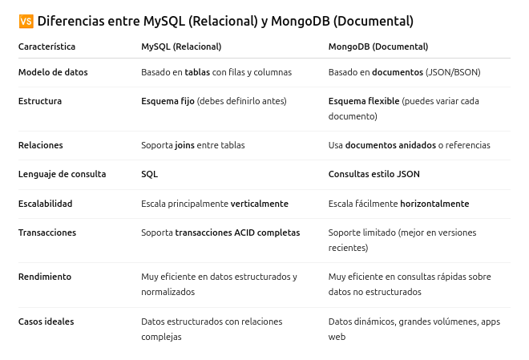
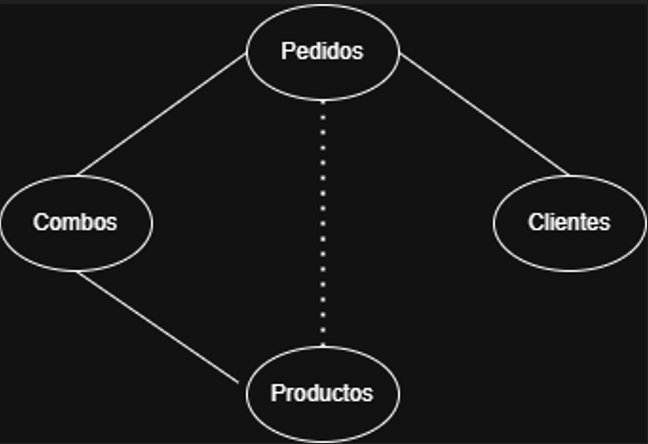
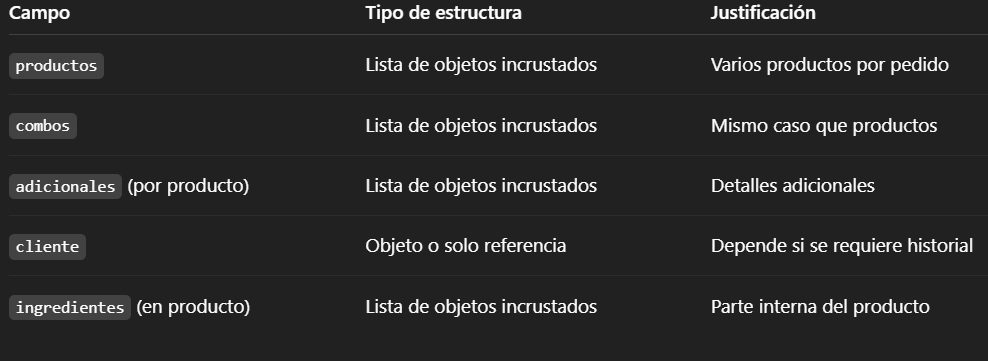

# Taller: Modelado NoSQL Documental con MongoDB para una Pizzería

### 1. Investigación

**- ¿Qué es una base de datos NoSQL?**

    Una base de datos NoSQL (Not Only SQL) es un tipo de base de datos que no utiliza el modelo relacional tradicional basado en tablas y filas, sino que emplea modelos de datos más flexibles como documentos, pares clave-valor, grafos o columnas.

    Estas bases de datos están diseñadas para manejar grandes volúmenes de datos no estructurados o semi-estructurados, y son ideales cuando se necesita escalabilidad horizontal, alta disponibilidad y rendimiento en aplicaciones distribuidas.

**- ¿Qué es MongoDB?**

    MongoDB es una base de datos NoSQL orientada a documentos, desarrollada para manejar grandes volúmenes de datos de forma flexible, escalable y eficiente. A diferencia de las bases de datos relacionales que almacenan datos en tablas, MongoDB almacena la información en documentos BSON (una extensión de JSON).

    CARACTERISTICAS PRINCIPALES:

    📄 Documentos: Los datos se almacenan en documentos similares a JSON ({ clave: valor }), lo que permite estructuras complejas y anidadas.

    🔄 Sin esquema fijo: No necesitas definir una estructura rígida, lo que facilita cambios rápidos en los datos.

    🚀 Escalable horizontalmente: Soporta particionamiento automático de datos entre múltiples servidores (sharding).

    🔍 Consultas flexibles: Permite realizar búsquedas, filtros y agregaciones complejas.

    🧩 Compatible con múltiples lenguajes: Tiene drivers para JavaScript, Python, Java, C#, entre otros.

    EJEMPLO:
            {
            "nombre": "Max",
            "especie": "Perro",
            "edad": 5,
            "vacunas": ["rabia", "moquillo"],
            "propietario": {
                "nombre": "Ana",
                "telefono": "3124567890"
            }
            }

**- ¿Qué diferencia hay entre una base de datos relacional (como MySQL) y una base de datos documental como MongoDB?**

    Una base de datos relacional, como MySQL, organiza los datos en tablas compuestas por filas y columnas. Cada tabla tiene un esquema fijo, es decir, la estructura de los datos debe definirse por adelantado. Las relaciones entre datos se gestionan a través de claves primarias y foráneas, lo que permite realizar operaciones como joins para combinar información de varias tablas.

    Por otro lado, una base de datos documental, como MongoDB, almacena los datos en documentos con formato similar a JSON (llamado BSON internamente). Estos documentos son autocontenidos y flexibles, lo que significa que no necesitan un esquema fijo. Cada documento puede tener una estructura diferente, adaptándose fácilmente a cambios en los datos.

    En cuanto al lenguaje de consulta, MySQL usa SQL, un lenguaje estándar estructurado, mientras que MongoDB utiliza consultas con sintaxis tipo JSON, más intuitivas para los desarrolladores web.

    En términos de escalabilidad, MySQL normalmente escala verticalmente (mejorando el hardware del servidor), mientras que MongoDB fue diseñado para escalar horizontalmente (distribuirse entre varios servidores fácilmente).

    Finalmente, MySQL es ideal para aplicaciones donde los datos están bien estructurados y hay muchas relaciones complejas entre ellos (como sistemas bancarios o de gestión escolar), mientras que MongoDB es excelente para aplicaciones que manejan grandes volúmenes de datos dinámicos o que cambian con frecuencia, como redes sociales, blogs, o tiendas en línea.

    🧠 EN RESUMEN:

    - Usa MySQL si necesitas relaciones fuertes entre tablas, transacciones estrictas y datos bien estructurados.

    - Usa MongoDB si necesitas flexibilidad, velocidad con grandes volúmenes de datos, y tu aplicación cambia de estructura con frecuencia.

**- ¿Qué son documentos y colecciones en MongoDB?**

    En MongoDB, los documentos y las colecciones son las estructuras fundamentales para almacenar y organizar datos. Funcionan de forma parecida a las filas y tablas en bases de datos relacionales, pero son mucho más flexibles.

    📄 DOCUMENTO:

    Un documento en MongoDB es una unidad de datos que se guarda en formato BSON (una versión binaria de JSON). Es como un objeto en JavaScript, compuesto por pares clave: valor. Cada documento puede tener su propia estructura, lo que permite almacenar datos complejos y anidados.

    EJEMPLO DE DOCUMENTO:

    {
    "nombre": "Nico",
    "edad": 21,
    "cursos": ["SQL", "JavaScript", "MongoDB"],
    "activo": true
    }

    No necesitas definir una estructura antes de guardar el documento.

    Puedes incluir arreglos, otros documentos dentro del documento (anidados), números, booleanos, etc.

    🗂️ COLECCIÓN:

    Una colección es un grupo de documentos relacionados entre sí. Sería el equivalente a una tabla en una base de datos relacional.

    Todos los documentos dentro de una colección no necesitan tener el mismo formato.

    Puedes pensar en una colección como un "contenedor" que agrupa todos los documentos de un mismo tipo, por ejemplo: usuarios, productos, clientes, etc.

    EJEMPLO:

    Una colección llamada mascotas puede tener estos documentos:

    {
    "nombre": "Luna",
    "especie": "Gato"
    }

    {
    "nombre": "Max",
    "especie": "Perro",
    "edad": 5
    }

    EN RESUMEN:

    - Un documento es una unidad individual de datos en formato JSON/BSON.

    - Una colección es un conjunto de documentos agrupados por tema o tipo.

    MongoDB te da flexibilidad porque los documentos dentro de una misma colección pueden variar en estructura.

---

### 2. Diseño de propuesta

**- Imaginen y propongan **qué colecciones tendrían**.**

**- ¿Qué información tendría un documento de pedido? ¿Y un producto?**
-Documento de pedido:

    {
        "_id": "pedido001",
        "fecha": "2025-05-30T19:00:00Z",
        "metodoPago": "tarjeta",
        "modalidad": "mesa",
        "cliente": {
        "_id": "cliente123",
        "nombre": "Juan Pérez",
        "telefono": "3001234567"
    },
    
    "productos": [
    {
        "_id": "prod001",
        "nombre": "Pizza Hawaiana",
        "cantidad": 2,
        "precioUnitario": 25000,
        "adicionales": [
        {
            "nombre": "Extra queso",
            "precio": 3000
        }
        ]
    }
    ],
    "combos": [
    {
        "_id": "combo01",
        "nombre": "Combo Familiar",
        "cantidad": 1,
        "precio": 45000
    }
    ],
        "total": 98000 
    }

-Documento de Producto:

    {
        "_id": "prod001",
        "nombre": "Pizza Hawaiana",
        "precio": 25000,
        "categoria": "pizza",
        "disponible": true,
        "elaborado": true,
        "ingredientes": [
            { "nombre": "jamón", "cantidad": "100g" },
            { "nombre": "piña", "cantidad": "50g" },
            { "nombre": "queso", "cantidad": "150g" }
        ]
    }

**- ¿Qué iría dentro del documento y qué se referenciaría?**
    Incrustado en el pedido (embed):

    Datos del cliente (simplificado si no necesitas más relaciones).

    Productos pedidos con sus cantidades y adicionales.

    Combos pedidos.

    Referenciado:

    Si los productos, clientes o combos cambian con frecuencia o se relacionan con muchas colecciones, podrían referenciarse con solo el _id.

    Ejemplo con referencias:

    "clienteId": "cliente123",
    "productos": [{ "productoId": "prod001", "cantidad": 2 }]

**- ¿Qué campos serían listas, objetos u otros documentos incrustados?**

    
---

### 3. Documentos JSON

**- Un producto (ej. pizza con ingredientes)**

    Productos = [
        {"id": 1,
        "nombre": "Pizza de pollo",
        "categoria":["pizza"],
        "ingredientes": ["pollo", "champiñon"],
        "precio": 6000,
        "elaborado": true,
        "disponible": true},

        {"id": 2,
        "nombre": "Panzerotti de carne",
        "categoria":["panzerotti"],
        "ingredientes": ["carne", "jamon"],
        "precio": 8000,
        "elaborado": true,
        "disponible": true},

        {"id": 3,
        "nombre": "Agua",
        "categoria":["bebida"],
        "ingredientes": [],
        "precio": 2000,
        "elaborado": false,
        "disponible": true},
    ]

**- Un combo**

    Combos = {
        "1": {"Nombre": "Familiar", 
            "descripcion": "Alcanza para 6 personas", 
            "precio": 68000},

        "2": {"Nombre": "Pareja", 
            "descripcion": "Alcanza para 2 personas", 
            "precio": 46000},

        "3": {"Nombre": "Solitario", 
            "descripcion": "Alcanza para 1 persona", 
            "precio": 32000},
    } 

**- Un pedido con un cliente y varios productos (algunos personalizados)**

    Pedidos = [
        {"id": 1,
        "nombre": "Juan Mariño",
        "modalidadPedido":["recoger"],
        "metodoPago": ["efectivo"],
        "precio": 95000,
        "producto": {"Familiar", "Agua"},
        "adicionales": ["tocineta"]},

        {"id": 2,
        "nombre": "Nicolas Espitia",
        "modalidadPedido":["mesa"],
        "metodoPago": ["credito"],
        "precio": 21000,
        "producto": {"Pizza de pollo", "Agua"},
        "adicionales": ["extra queso", "cebolla"]},

        {"id": 3,
        "nombre": "Santiago Pedraza",
        "modalidadPedido":["mesa"],
        "metodoPago": ["debito"],
        "precio": 64000,
        "producto": {"Panzerotti de carne", "Agua"},
        "adicionales": ["maiz"]}
    ]

---

### 4. Reflexión

**- ¿Qué fue lo más difícil de imaginar sin tablas?**

    Lo más difícil fue imaginar cómo se manejan las relaciones entre datos sin usar tablas ni claves foráneas. En bases de datos relacionales todo está bien estructurado con tablas conectadas entre sí, pero en MongoDB hay que pensar diferente, usando documentos que contienen toda la información o que se referencian entre sí.

    Al principio cuesta entender cómo organizar los datos sin dividirlos en tablas, y cómo mantener el orden o la integridad de la información. Es cambiar esa forma de pensar lo más complicado.

**- ¿Qué les gustó del enfoque con documentos?**

    Aunque al principio fue un cambio de mentalidad, la idea de tener datos autosuficientes en documentos  nos pareció muy eficiente para ciertos casos de uso, como sistemas de pedidos o catálogos de productos. Sin embargo, también entendimos que NoSQL no reemplaza a las bases relacionales, sino que es una herramienta más para elegir según el proyecto.

**- ¿Qué dudas les surgieron al pensar en este nuevo tipo de base de datos?**

    Una de las dudas más persistentes durante la realización del taller fue entender cómo se maneja la relación entre datos en NoSQL, especialmente porque venimos de trabajar con bases de datos relacionales donde las tablas intermedias son fundamentales para conectar información. Nos resultó complicado imaginar cómo unir todos los datos en una sola colección de documentos, ya que estábamos acostumbrados a utilizar llaves foráneas y relaciones explícitas para estructurar la información.

